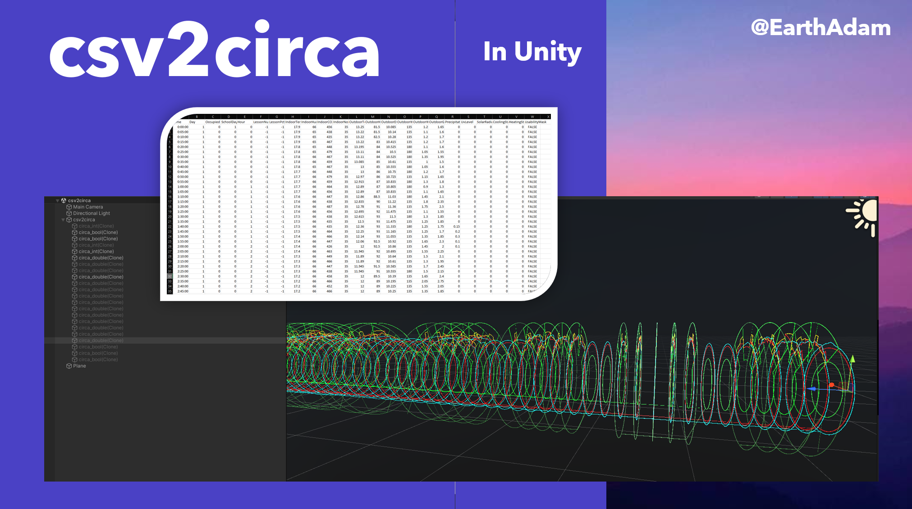

# csv2circa
Ingestion for CSV-based data into circadian rhythm format

See [csv2lines](https://github.com/Circaevum/csv2lines) for standard linear version

Simplest approach: download the csv2circa [Unity Package](./csv2circa.unitypackage), and `Import` into your project.

**The Data**  
This is using publicly available data: [Indoor Sensors](https://physionet.org/content/in-gauge-and-en-gage/1.0.0/
), which captures 23 fields every 5 minutes for a span of 169 days (using `KB5.csv` for this project).
